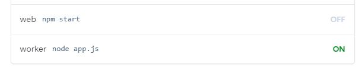

# Mr.Grape

	

A fun open source discord bot made using discord.js
music, economy and more!

#### Basic info

Contains a wide variety of music commands using ytdl-core, and has a very expansive economy systen with many features such as a shop and inventory. This also has many other commands such as kick and banning, purging, and as well as many fun commands.

# Note
 The original Prefix is `+`, although you can change the prefix with `+prefix <prefix>`
Many of the API's used here have private keys, and thus you will have to get your own api keys from the apis.

# API's
The links for the apis to where you get your own api key for usage.
https://api.ksoft.si/
https://thecatapi.com/
https://thedogapi.com/
https://api.nasa.gov/
https://products.wolframalpha.com/api/

# Setup
 Press the deploy to Heroku Button, give the app a name.
Make sure you have a application made in https://discord.com/developers/applications, create a bot under that application, and get the BOT TOKEN from there.
Once the heroku app is deployed, go to Configure dynos and make sure web dyno is off and worker dyno is on like so:

	

Once that is done, you will wanna go to Settings and under config vars, you wanna name a key called BOT_TOKEN. Then as the value, you will wanna paste in the token in the bot under the application. Do not share this token with anyone, or that person will have access to your bot. Then once you have that, you will wanna get your own api keys for the apis listed above, and then put in the names of the apis and the keys in the value, like so:

	

