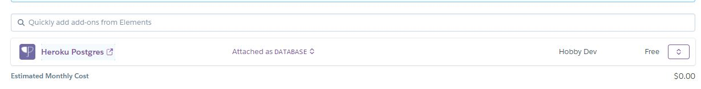

	
	<h1>Mr. Grape</h1>
	
By kinglalu#2780 and DAONE#7538

	
Mr. Grape is an Open Source Discord Bot made using Discord.js that includes Music features, an Economy and more!

	
 Help support Mr Grape by voting for it here on top.gg; https://top.gg/bot/743833062265323651/vote 

	

	

## About

Mr. Grape contains a wide variety of music commands using `ytdl-core`, and has a well-developed economy system with features such as user shops and an inventory. In addition, Mr. Grape has moderation commands for kicking and banning members, as well as purging messages. This just scratches the surface of what Mr. Grape can do, as there is an extensive list of fun commands that add flavor to any server it's in.

## Notes
* The bot's prefix is `+`, however this can be changed with the command `+prefix <new prefix>`.
* Many of the APIs used in Mr. Grape require private keys to be issued and added before those services will work.

## APIs Used
You will need to go to each of these websites and acquire an API key for each of their associated services.
* https://api.ksoft.si/
* https://thecatapi.com/
* https://thedogapi.com/
* https://api.nasa.gov/
* https://products.wolframalpha.com/api/

## Setup

 Press the "Deploy to Heroku" button, and give the app a name.
Make sure you have a application made in https://discord.com/developers/applications, create a bot under that application, and get the BOT TOKEN from there.
Once the Heroku app is deployed, go to Configure dynos and make sure web dyno is off and worker dyno is on like so:

	

Once that is done, go to Settings and under config vars, make a key called `BOT_TOKEN`. Then as the value, paste in the token you got earlier. Do not share these tokens with anyone, or that person will have access to your bot. Then once you have that, get your API keys for the APIs listed above, then put in the names of the APIs and the keys in the value, like so:

	

Finally, you will need a database to store the data of the players using the economy commands. We use keyv, but it can be easily edited to use a diffrent db such as MongoDB, Redis, etc. Go to Resources tab, and where you see Add-ons, Search "Heroku Postgres" or "Heroku Redis", and attach it as a database, like so:

	

If you used the onboard add-on databases provided by Heroku, you are good to go! If you used an external db outside of Heroku, then make a config var called `DATABASE_URL` and put the database's connection url in it. You should be all set and the bot should be online. For any questions or inquires, feel free to join the discord and ask! https://discord.gg/bYFkqsdmqQ
